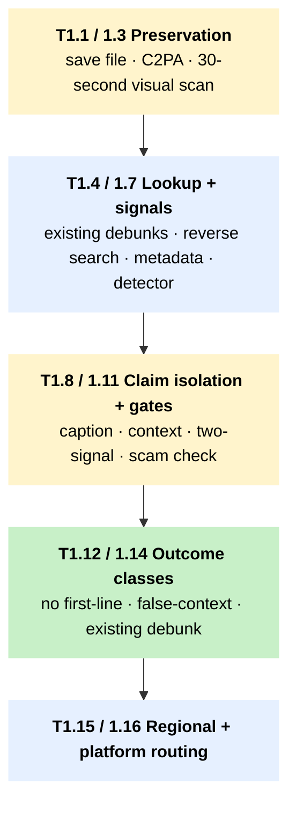

# T1 – First-line triage for a suspected AI-generated image

!!! abstract "TL;DR"
 Use this tree when a viral image lands in your queue and you need a defensible first-line judgment in five to thirty minutes, before publishing, amplifying, or escalating. The tree leads with file preservation, provenance, reverse search, and existing debunks, and reaches a detector only after non-detector signals are exhausted.

## When to use this tree

A fact-checker receives a meme, an alleged photo, a poster, or an AI-looking still from TikTok, Facebook, WhatsApp, LINE, or Telegram. The claim attached to it might be about a real person, a place, an event, an endorsement, or simply "look at this AI image." Three questions tangle together in the first ten minutes of newsroom practice: is the file authentic, is the depicted scene real, and is the caption true. They are not the same question. T1 keeps them apart and, depending on which one breaks, routes the case onward to [Professional Verification](../pillar-1-detection/1b-professional-verification.md) ([T5](t5-escalation.md)), to coordinated-operation analysis, or straight into a counter-disinformation response when the claim is already verifiable as false.

## The tree

The diagram is a **macro view** of the main first-line chain. Click any block to jump to its Node detail row.

Side exits, kept out of the diagram for clarity:

- **Vulnerable source** at [T1.1](#t1-1) → [T6 S1 source-protection](t6-source-protection.md) (always-on for source-identifying files).
- **Hosted detector** at [T1.7](#t1-7) → check S1 / S9 before any third-party upload.
- **Scam or impersonation** at [T1.11](#t1-11) → [T7 scam response](t7-tipline-routing.md) and platform escalation.
- **Two signals, high harm** at [T1.10](#t1-10) → [T5.1 professional verification](t5-escalation.md).
- **Coordinated reuse** at [T1.10](#t1-10) → coordinated-operation analysis (1C Institutional Analysis).

## How to read this tree

Run the nodes in order from T1.1, unless the case throws a callout. Each node sits in a one-to-ten-minute slice per Foundational Decision 1; the whole tree fits inside the thirty-minute [First-Line Triage](../pillar-1-detection/1a-first-line-triage.md) window. The macro view above collapses individual T1.X steps into five blocks (yellow for decisions, blue for actions, green for outcomes); the full 16-row operational layer lives in the *Node detail* table below, and the side-exit callouts to T5, [T6](t6-source-protection.md), and [T7](t7-tipline-routing.md) are listed above the table as bullet links. One sentence the tree exists to enforce: a high AI-probability detector score at T1.7 does not license a synthetic label on its own. Anchor 2 asks for two non-detector signals, and Anchor 3 collapses multi-detector consensus down to one signal class. If the only evidence is a detector, the answer is "tool flagged for review," not "deepfake."

The four classes of first-line outcome are:

- existing debunk found, ready for response (T1.14 → T7);
- old or authentic image used in false context (T1.13 → response or T5);
- synthetic or manipulated likely, but not publication-grade (T1.10 → T5);
- no first-line evidence of AI manipulation, ordinary verification continues (T1.12 → [T4](t4-provenance-triage.md) / T7 logic).

## Node detail

| Node | Question or action | Time | Tools |
|---|---|---|---|
| T1.1 | Do you have the original file or only a screenshot? Save platform, sender, URL, timestamp, caption, and forwarding state. | 1 to 2 min | – |
| T1.2 | Does the file carry C2PA / Content Credentials? Read creator, edit history, AI-use disclosure. | 1 to 3 min | [Content Credentials Verify](../tool-cards/content-credentials-verify.md), [C2PA Conformance Explorer](../tool-cards/c2pa-conformance-explorer.md) |
| T1.3 | In thirty seconds: zoom once, check hands, teeth, text, logos, shadows, repeated faces. Write only observable issues. | 30 to 60 sec | – |
| T1.4 | Has this image or claim already been fact-checked? Search global and local fact-check databases. | 2 to 5 min | [Google Fact Check Explorer](../tool-cards/google-fact-check-explorer.md), local archives via T1.15 |
| T1.5 | Can you find an older or cleaner copy? Reverse-search full image then crops. | 3 to 7 min | [InVID-WeVerify](../tool-cards/invid-weverify.md) |
| T1.6 | Does metadata support, contradict, or fail to answer the claim? Read EXIF on the original only. | 3 to 5 min | [InVID-WeVerify](../tool-cards/invid-weverify.md), [ExifTool](../tool-cards/exiftool.md), [MetaDataKit](../tool-cards/metadatakit.md), [Sherloq](../tool-cards/sherloq.md) for source-protected work |
| T1.7 | Run no more than two first-line detectors. Record score, file version, language caveat, upload risk. | 3 to 8 min | [Hive AI](../tool-cards/hive-ai.md), [ImageWhisperer](../tool-cards/imagewhisperer.md), [Deepware Scanner](../tool-cards/deepware-scanner.md), [InVID-WeVerify](../tool-cards/invid-weverify.md) deepfake tab |
| T1.8 | Reduce the caption to one sentence. Separate image authenticity from caption truth. | 1 to 3 min | – |
| T1.9 | Are place, time, weather, shadows, landmarks, and uniforms plausible? | 5 to 10 min | [GeoSpy](../tool-cards/geospy.md) for leads, plus map and street-view checks |
| T1.10 | Do you have at least two independent signals of synthetic or manipulated image? | 3 to 5 min | – |
| T1.11 | Is this part of a public-figure impersonation, endorsement, charity, or investment scam? Capture funnel destinations. | 3 to 6 min | – |
| T1.12 | Record "no first-line evidence of AI manipulation; claim still requires ordinary verification." Do not call it authentic. | 1 to 2 min | – |
| T1.13 | Authentic or older image used in false context. Save earlier source, current caption, date mismatch. | 3 to 5 min | – |
| T1.14 | Confirm an existing exact debunk matches image, claim, language, and date. Do not rerun unless the new context changes the claim. | 2 to 4 min | local archive plus [Google Fact Check Explorer](../tool-cards/google-fact-check-explorer.md) |
| T1.15 | Local-language routing. See country block below. | 3 to 10 min | local fact-check partners |
| T1.16 | Platform routing. See platform block below. | 1 to 5 min | – |

## Regional and platform routing

T1.15 is the country-language branch. Apply S2 (state-linked or legally sensitive investigation) for Laos and high-risk Sri Lanka, Thailand, Philippines, Indonesia, and Malaysia state-linked claims before any outreach.

| Suffix | Country | First-line verification path |
|---|---|---|
| `-id` | Indonesia | TurnBackHoax / [MAFINDO Yudistira](../tool-cards/yudistira-mafindo.md) and Tempo Cek Fakta; [Kalimasada](../tool-cards/mafindo-kalimasada.md) tipline if the source is on WhatsApp. |
| `-ms` | Malaysia | [Sebenarnya AIFA](../tool-cards/sebenarnya-aifa.md) – treat the government-operator caveat as load-bearing; pair with an independent newsroom check. |
| `-thai` | Thailand | [Cofact Thailand](../tool-cards/cofact-thailand.md) on LINE; Thai PBS Verify and AFP Thailand partners. |
| `-ph` | Philippines | [VERA Files](../tool-cards/x-claim.md) (X-CLAIM coalition), Rappler, #FactsFirstPH. |
| `-si-ta` | Sri Lanka | Fact Crescendo, AFP Sinhala / Tamil, Hashtag Generation; [Watchdog Dissect](../tool-cards/dissect-watchdog-lirneasia.md) where stylometric analysis is needed. |
| `-lao` | Laos | No documented Lao-first independent fact-checker. Route through trusted regional or diaspora partner; see the Laos country page. |

T1.16 is the platform branch. Apply S5 (private or encrypted group collection) before any infiltration of closed groups – tipline submissions only.

- `-tiktok`: prioritise still-frame origin, watermark, and repost chain. If the image came from a video, leave T1 and enter [T2](t2-video-triage.md).
- `-wa`: do not scrape private chats. Use only user-submitted forwards and tipline logs.
- `-line`: for Thai content, route through Cofact first.
- `-telegram`: preserve URL and channel metadata for public channels; private requires consent.
- `-fbg`: preserve group / post URL, group visibility, admin and page info.

## Cross-references

This tree feeds into:

- [T2 – video triage](t2-video-triage.md) when the image was lifted from a video.
- [T3 – audio triage](t3-audio-triage.md) when the image carries audio context (image-with-voice-note bundles on WhatsApp).
- [T4 – provenance triage](t4-provenance-triage.md) when the case turns on C2PA / Content Credentials interpretation.
- [T5 – escalation](t5-escalation.md) when first-line evidence is inconclusive but the harm is high, or when two detectors disagree.
- [T6 – source-protection](t6-source-protection.md) before any upload at T1.7 if the source is vulnerable; S1 always-on for source-identifying material.
- [T7 – tipline routing](t7-tipline-routing.md) when the response goes back to the user via a country tipline.

Anchor tool cards: [InVID-WeVerify](../tool-cards/invid-weverify.md) carries the bulk of the non-detector toolkit at this tier; [Hive AI](../tool-cards/hive-ai.md) and [ImageWhisperer](../tool-cards/imagewhisperer.md) are the two first-line detector options. [Content Credentials Verify](../tool-cards/content-credentials-verify.md) is the fastest provenance check when the file has a C2PA manifest.

## Sources

- WITNESS Media Lab and Reuters Institute. *Thinking About Deepfakes: A Verification Framework for Journalists.* WITNESS, April 2024. [witness.org](https://lab.witness.org/backgrounder-deepfakes-in-2020/). (First-line triage methodology; two-non-detector-signals discipline underpinning T1.6 and T1.13.)
- Ha, B. et al. *Organic or Diffused: Can We Distinguish Human Art from AI-generated Images?* ACM CCS 2024. (Image detector robustness under adversarial edits; basis for detector-as-weak-signal framing at T1.5–T1.8.)
- [InVID-WeVerify](../tool-cards/invid-weverify.md) Consortium. *InVID-WeVerify Plugin Documentation: Image Verification Workflows.* WeVerify Project, 2023. [weverify.eu](https://weverify.eu/). (Reverse-image, EXIF, and keyframe workflows at T1.4–T1.5.)
- [Architectural Anchors](../methodology/architectural-anchors.md) — the three signal-architecture rules this tree operationalises.
