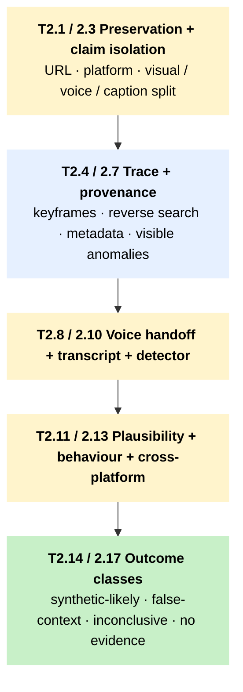

# T2 – First-line triage for a suspected AI-generated video

!!! abstract "TL;DR"
    Use this tree for short videos, livestream clips, political endorsements, alleged protest or violence footage, and screen recordings carrying cloned audio. The tree separates URL preservation, keyframe-driven reverse search, and source behaviour from synthetic-video detection, which sits at the end as a weak signal.

## When to use this tree

Short-form video is where most of the synthetic-content workload lands in regional newsrooms, and it is also where the forensic surface is weakest. TikTok, Reels, and Shorts re-encode aggressively: real compression artefacts mimic synthetic ones, and cloned audio survives the same compression that erases visual detector signal. The tree leads with URL and keyframe preservation because evidence is fragile. TikTok takedowns, Facebook share-edits, and LINE re-encoding all destroy what a forensic step would otherwise read. When the voice carries the central claim and the picture does not, the workflow leaves T2 for [T3](t3-audio-triage.md) and returns only after audio is resolved.

## The tree

The diagram is a **macro view** of the main video-triage chain. Click any block to jump to its Node detail row.

Side exits, kept out of the diagram for clarity:

- **Vulnerable source** at [T2.1](#t2-1) → [T6 S1 / S5 source-protection](t6-source-protection.md).
- **Voice central** at [T2.8](#t2-8) → [T3.1 audio triage](t3-audio-triage.md); return after audio is resolved.
- **C2PA manifest present** at [T2.6](#t2-6) → [T4 provenance triage](t4-provenance-triage.md) for the validation chain.
- **Caption-only claim** at [T2.3](#t2-3) → ordinary claim verification (no synthetic-media path).
- **Detector conflict** at [T2.10](#t2-10) → [T5 escalation (Anchor-3 reset)](t5-escalation.md).
- **Cross-platform synchronised reuse** at [T2.13](#t2-13) → coordinated-operation analysis (1C).
- **Two signals, high harm** at [T2.14](#t2-14) → [T5.1 professional verification](t5-escalation.md).

## How to read this tree

Video carries two evidentiary surfaces – picture and voice – and either can be authentic while the other is fabricated. That is why T2 runs longer than [T1](t1-image-triage.md) or T3. Work T2.1 through T2.6 first; if the voice ends up carrying the claim, jump to [T3](t3-audio-triage.md) at T2.8 and come back only when the audio-side answer is in. Keep three ledgers open while the case moves: claim authenticity, voice authenticity, and caption truth. Each gets resolved on its own evidence. A real video with a fake voice and a misleading caption is the typical Indonesia, Malaysia, and Philippines short-form pattern; collapsing the three early is what produces both false positives and the liar's-dividend abuse on the other side.

The four classes of first-line outcome are:

- old or authentic video used in false context (T2.15 → response or [T5](t5-escalation.md));
- likely synthetic or manipulated video, requiring [professional verification](../pillar-1-detection/1b-professional-verification.md) (T2.14 → T5);
- caption or transcript mismatch, ready for fact-check correction (→ [T7](t7-tipline-routing.md));
- no first-line manipulation evidence (T2.17 → ordinary verification continues).

Plus two hand-offs: T2.8 sends voice-central cases into T3, and T2.13 sends multi-account synchronised reuse into the coordinated-operation analysis branch.

## Node detail

| Node | Question or action | Time | Tools |
|---|---|---|---|
| T2.1 | Save URL, uploader name, platform, upload time, caption, and pinned comments. Request original if safe. | 1 to 3 min | – |
| T2.2 | Platform preservation: TikTok, Facebook, WhatsApp / LINE, Telegram, YouTube. | 2 to 5 min | [Auto Archiver](../tool-cards/auto-archiver.md), [Citizen Evidence Lab YDV](../tool-cards/citizen-evidence-lab-ydv.md) for YouTube. |
| T2.3 | Write the claim as one sentence. Identify whether the visual scene or the voice is doing the evidentiary work. | 1 to 2 min | – |
| T2.4 | Extract five to ten representative keyframes. | 3 to 6 min | [InVID-WeVerify](../tool-cards/invid-weverify.md), [Citizen Evidence Lab YDV](../tool-cards/citizen-evidence-lab-ydv.md) |
| T2.5 | Reverse-search full keyframes and cropped landmarks, faces, signs. Search several frames, not only the first. | 5 to 10 min | [InVID-WeVerify](../tool-cards/invid-weverify.md) |
| T2.6 | Read provenance / metadata only if the original file exists. Treat absent metadata as normal on TikTok / WhatsApp / LINE. | 3 to 6 min | [InVID-WeVerify](../tool-cards/invid-weverify.md), [MetaDataKit](../tool-cards/metadatakit.md), [ExifTool](../tool-cards/exiftool.md), [Content Credentials Verify](../tool-cards/content-credentials-verify.md) |
| T2.7 | Watch at normal then half speed. Lip-sync, face edges, lighting, reflections, hand interactions, sudden cuts. | 2 to 5 min | – |
| T2.8 | Voice central? Separate the audio question from the visual; route into T3 while continuing visual checks. | 1 to 3 min | – |
| T2.9 | Transcript matches caption? Use ASR plus local-language reviewer. | 5 to 15 min | [OpenAI Whisper](../tool-cards/openai-whisper.md), [Google Cloud Translation](../tool-cards/google-cloud-translation.md) |
| T2.10 | Two first-line video detectors at most. Record file quality, score, upload safety. | 5 to 15 min | [InVID-WeVerify](../tool-cards/invid-weverify.md) deepfake tab, [Deepware Scanner](../tool-cards/deepware-scanner.md), [Hive AI](../tool-cards/hive-ai.md), [TrueMedia / Georgetown](../tool-cards/truemedia-georgetown.md) |
| T2.11 | Event plausible? Schedules, prior posts, weather, landmarks, uniforms, signage. | 5 to 15 min | [GeoSpy](../tool-cards/geospy.md) for leads, manual OSINT |
| T2.12 | Account age, post history, sudden topic shift, repost watermarks, off-platform funnel. | 5 to 10 min | – |
| T2.13 | Cross-platform identical reuse. Search exact caption, key quote, distinctive frame across TikTok, Facebook, Telegram, local fact-check or tipline systems. | 10 to 20 min | [Information Tracer](../tool-cards/information-tracer.md), [Media Cloud](../tool-cards/media-cloud.md) |
| T2.14 | Two independent classes of synthetic / manipulated evidence. Build the packet for T5; do not publish "confirmed deepfake" without provenance, expert, or source confirmation. | 5 to 10 min | – |
| T2.15 | Authentic or older video used in false context. Save earlier source, current misleading caption, date and place mismatch. | 5 to 10 min | – |
| T2.16 | Inconclusive but high impact. Bundle file or URL, keyframes, transcript, platform notes, tool outputs, unanswered questions. Hand off to T5. | 5 to 10 min | – |
| T2.17 | No first-line manipulation evidence. Continue ordinary claim verification. | 1 to 2 min | – |

## Regional and platform routing

The country branches mirror T1.15 and T7.20: see [T7 – tipline routing](t7-tipline-routing.md) for the full per-country deployment table.

Platform branch:

- `-tiktok` / `-fb`: capture URL before takedown; keep raw file alongside the URL because Facebook share-edits propagate.
- `-wa` / `-line`: tipline submissions only; do not expose sender identity.
- `-telegram`: public channel data plus message ID for public posts; private channels under S5.
- `-youtube`: prefer [Citizen Evidence Lab YDV](../tool-cards/citizen-evidence-lab-ydv.md) for upload time and thumbnail provenance.

Apply S2 for state-linked or legally sensitive video in Laos, Sri Lanka, Thailand, Philippines red-tagging, Indonesia EIT Law, Malaysia CMA contexts before any contact with subjects, uploaders, or authorities.

## Cross-references

- [T1 – image triage](t1-image-triage.md) – when a single keyframe carries the claim.
- [T3 – audio triage](t3-audio-triage.md) – called from T2.8 when the voice is central.
- [T4 – provenance triage](t4-provenance-triage.md) – when T2.6 surfaces a C2PA manifest.
- [T5 – escalation](t5-escalation.md) – when T2.10 detectors conflict, T2.14 likely-synthetic, or T2.16 inconclusive-high-impact.
- [T6 – source-protection](t6-source-protection.md) – S1 if the original file identifies a source; S5 if the case enters private-group territory; S9 for cross-border vendor retention before invoking detectors.

## Sources

- WITNESS Media Lab and Reuters Institute. *Thinking About Deepfakes: A Verification Framework for Journalists.* WITNESS, April 2024. [witness.org](https://lab.witness.org/backgrounder-deepfakes-in-2020/). (Video triage methodology; keyframe and motion-physics checks at T2.3–T2.5.)
- Lyu, S. et al. *Deepfake-Eval-2024: A Real-World Benchmark for Deepfake Detection.* 2025. [arxiv.org/abs/2503.02857](https://arxiv.org/abs/2503.02857). (Best commercial video detector 0.78 accuracy / 0.79 AUC; category ceiling underlying T2.10 detector-conflict handling.)
- [InVID-WeVerify](../tool-cards/invid-weverify.md) Consortium. *InVID-WeVerify Plugin Documentation.* WeVerify Project, 2023. [weverify.eu](https://weverify.eu/). (Keyframe extraction, reverse-image, and deepfake-tab workflows at T2.3–T2.9.)
- [Architectural Anchors](../methodology/architectural-anchors.md) — Anchors 1, 2, and 3 as operationalised in this tree.
