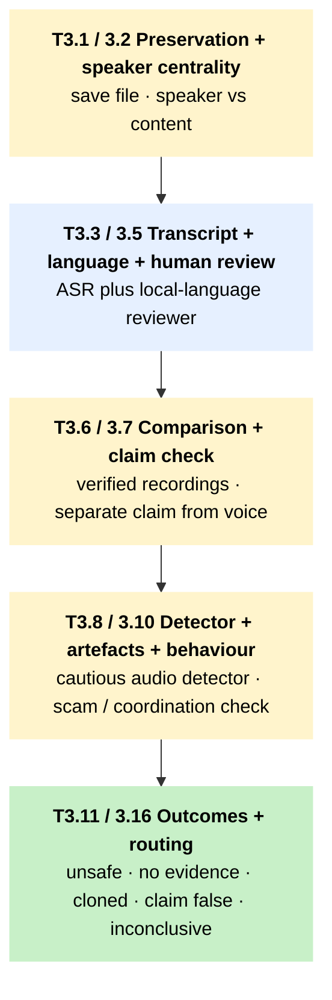

# T3 – First-line triage for a suspected AI-generated audio or voice clone

!!! abstract "TL;DR"
    Use this tree when a viral voice note or alleged leaked call lands in your queue and you need a defensible position before publishing or amplifying. Audio deepfake detection is the most fragile detector class in the toolkit; the workflow leans on transcription, speaker context, distribution pattern, and local-language review, with a detector run only if it is safe to upload.

## When to use this tree

Most synthetic-speech work in the region arrives through WhatsApp voice notes and LINE forwards. Alleged leaked calls of officials, religious leaders, election candidates, and emergency announcements move fast in closed groups and reach newsrooms through tiplines, not public timelines. The tree is shaped by two stubborn facts. Audio detector accuracy collapses on phone-recorded clips, tonal languages, Sinhala, Tamil, Lao, and WhatsApp / LINE codecs; a low score is not exculpatory, and a high score is not a verdict. And the file itself is the risk – uploading audio to a hosted detector exposes whoever is in the recording, so for source-identifying material the safety override (S1) takes precedence over any verification benefit.

## The tree

The diagram is a **macro view** of the main audio-triage chain. Click any block to jump to its Node detail row.

Side exits, kept out of the diagram for clarity:

- **Vulnerable source / unsafe upload** at any stage → [T3.11 hold or on-device](#t3-11); [T6 S1 / S2 source-protection](t6-source-protection.md).
- **Audio inside a video** at [T3.2](#t3-2) → [T2.8 video triage](t2-video-triage.md) plus T3.3 in parallel.
- **Low-coverage language, high harm** at [T3.4](#t3-4) → [T5.1 professional verification](t5-escalation.md).
- **Detector conflict** at [T3.8](#t3-8) → [T5 escalation (Anchor-3 reset)](t5-escalation.md).
- **Scam funnel** at [T3.10](#t3-10) → [T7 scam response](t7-tipline-routing.md).
- **Coordinated push** at [T3.10](#t3-10) → coordinated-operation analysis (1C).
- **Two cloned-audio signals, high harm** at [T3.13](#t3-13) → [T5.1 professional verification](t5-escalation.md).

## How to read this tree

T3 enforces an order newsrooms tend to invert under deadline pressure. Transcript and speaker context come first; the detector is last, and conditional. The hardest-working node is T3.4 (language coverage). ASR systems perform unevenly across the region: Indonesian, Malay, Thai, and Filipino / Tagalog have stronger documented coverage than Sinhala, Tamil, and Lao. Tonal languages, dialect, and code-switching push every category lower in practice. So a low-confidence transcript travels into T3.5 for human listening, not into T3.8 for detector runs. A misread word can change a claim's legal or political meaning, and the detector cannot recover what the transcript got wrong.

The five classes of first-line outcome are:

- claim is false even if voice authenticity is unresolved (T3.14 → response);
- two independent signals of cloned audio, requires [professional verification](../pillar-1-detection/1b-professional-verification.md) (T3.13 → T5);
- no first-line voice-clone evidence, ordinary verification continues (T3.12);
- inconclusive but consequential, hand-off to T5 (T3.15);
- unsafe to upload, hold or escalate via expert channel (T3.11).

## Node detail

| Node | Question or action | Time | Tools |
|---|---|---|---|
| T3.1 | Preserve audio exactly as received. Platform, sender, timestamp, file format, forwarded state. | 1 to 3 min | – |
| T3.2 | Does the claim depend on who is speaking, or on what was said? | 1 to 2 min | – |
| T3.3 | Run on-device or hosted ASR if safe. Manually check transcript with a local-language reviewer. | 5 to 15 min | [OpenAI Whisper](../tool-cards/openai-whisper.md), [Google Cloud Translation](../tool-cards/google-cloud-translation.md) |
| T3.4 | Mark confidence by language. Bahasa, Malay, Thai, Filipino acceptable; Sinhala, Tamil, Lao require local speaker before transcript is trusted. | 2 to 5 min | – |
| T3.5 | Human listening: trusted local-language reviewer verifies transcript, speaker cues, slang, parody or dub indicators. | 10 to 30 min | – |
| T3.6 | Compare against verified speeches, interviews, briefings, archives. Accent, cadence, breathing, schedule plausibility. | 10 to 20 min | – |
| T3.7 | Verify the spoken claim through fact-check archives and credible reporting. Separate from voice authenticity. | 5 to 20 min | [Google Fact Check Explorer](../tool-cards/google-fact-check-explorer.md), local archives via [T7](t7-tipline-routing.md) |
| T3.8 | Run one or two audio detectors only if safe. Record file quality, language caveat. | 5 to 15 min | [Hiya Loccus](../tool-cards/hiya-loccus.md) inside [InVID-WeVerify](../tool-cards/invid-weverify.md), [Hive AI](../tool-cards/hive-ai.md), [Reality Defender](../tool-cards/reality-defender.md), [TrueMedia / Georgetown](../tool-cards/truemedia-georgetown.md) |
| T3.9 | Listen with headphones and on phone speaker. Pacing, breaths, room tone, repeated noise beds, emotional mismatch. | 3 to 6 min | – |
| T3.10 | Distribution pattern: payment links, registration, "forward urgently," identical reposts, account farms. | 5 to 10 min | – |
| T3.11 | Unsafe upload: on-device transcription only or escalate via expert channel. S1 binding. | 1 to 3 min | [OpenAI Whisper](../tool-cards/openai-whisper.md) on-device |
| T3.12 | No first-line evidence of voice cloning. Content still requires claim verification. | 1 to 2 min | – |
| T3.13 | Two independent signals of cloned audio. Internal "suspected voice clone" only; do not publish without expert or source confirmation. | 5 to 10 min | – |
| T3.14 | Claim false regardless of audio authenticity. Lead the response on the claim, note that audio origin is unresolved. | 5 to 10 min | – |
| T3.15 | Inconclusive bundle: original file, transcript attempts, language caveats, detector outputs, comparison attempts. | 5 to 10 min | – |
| T3.16 | Platform and language routing. See block below. | 2 to 5 min | – |

## Regional and platform routing

Apply S1 for any source-identifying audio before any tool upload. Apply S2 for state-linked or legally sensitive cases in Laos, Sri Lanka OSA, Thailand Article 112, Philippines red-tagging, Indonesia EIT, Malaysia CMA contexts.

| Suffix | Notes |
|---|---|
| `-wa` | Voice notes: preserve forward, request original, tipline intake; no scraping. |
| `-line-thai` | Thai LINE audio: route through [Cofact Thailand](../tool-cards/cofact-thailand.md) and a local reviewer. |
| `-tiktok` / `-fb` | If audio is bound to video, run [T2](t2-video-triage.md) plus T3 in parallel. |
| `-telegram` | Public channel audio can enter coordinated analysis; private requires consent. |
| `-lao` | No documented Lao voice-clone detection or local fact-checking infrastructure. Escalate via trusted regional or diaspora partner. Honest gap: the toolkit names this absence on the page; it does not paper over it. |
| `-si-ta` | Sinhala / Tamil under-served by detector training; require local speaker review at T3.5 before any detector run. [Watchdog Dissect](../tool-cards/dissect-watchdog-lirneasia.md) covers stylometric work for related text content. |

Whisper coverage by language for T3.3 / T3.4: documented as stronger for Indonesian, Malay, Thai, Filipino / Tagalog; lower for Lao and Sinhala. [SEA-LION](../tool-cards/sea-lion.md) v4 (March 2026) extends to Lao for downstream NLP tasks, which can support the human reviewer at T3.5 but does not replace local listening.

## Cross-references

- [T2 – video triage](t2-video-triage.md) – called when audio sits inside a video; the visual side resumes after T3 returns.
- [T4 – provenance triage](t4-provenance-triage.md) – when an audio file carries C2PA / Content Credentials.
- [T5 – escalation](t5-escalation.md) – when T3 is inconclusive but consequential, or when two detectors disagree.
- [T6 – source-protection](t6-source-protection.md) – S1 always-on for source-identifying audio; S6 for detector-only accusations of voice cloning; S7 for scam funnels with payment / registration; S9 for cross-border vendor retention.
- [T7 – tipline routing](t7-tipline-routing.md) – when the response goes back to the user via the country tipline.

Anchor tool cards: [OpenAI Whisper](../tool-cards/openai-whisper.md) for on-device transcription that respects S1; [Hiya Loccus](../tool-cards/hiya-loccus.md) inside InVID for the cautious-detector signal; [Cofact Thailand](../tool-cards/cofact-thailand.md) and [Kalimasada](../tool-cards/mafindo-kalimasada.md) for tipline-bound responses on LINE and WhatsApp respectively.

## Sources

- WITNESS Media Lab and Reuters Institute. *Thinking About Deepfakes: A Verification Framework for Journalists.* WITNESS, April 2024. [witness.org](https://lab.witness.org/backgrounder-deepfakes-in-2020/). (Escalation criteria and inter-tool conflict resolution methodology.)
- [DW Innovation](../tool-cards/dw-innovation-audit.md). *Synthetic Audio Detectors Put to the Test.* Deutsche Welle, 29 September 2025. [innovation.dw.com/articles/synthetic-audio-detectors-tested](https://innovation.dw.com/articles/synthetic-audio-detectors-tested). (Ten-sample multilingual civil-society audit; Hiya identified 4/10 correctly; [Deepfake Total](../tool-cards/deepfake-total-stub.md) 7/10; DeepFake-O-Meter produced model-to-model contradictions across all samples. Basis for the cautious-detector framing at T3.8 and the "no audio detector reliably identifies AI voices across SEA languages" gate.)
- Lyu, S. et al. *Deepfake-Eval-2024: A Real-World Benchmark for Deepfake Detection.* 2025. [arxiv.org/abs/2503.02857](https://arxiv.org/abs/2503.02857). (Best commercial audio model: 0.89 accuracy / 0.93 AUC on 42-language benchmark, anonymised; no per-language or tonal-language SEA breakdown available.)
- [Architectural Anchors](../methodology/architectural-anchors.md) — the three signal-architecture rules this tree operationalises, including the SEA language coverage conditionality at Anchor 1.
