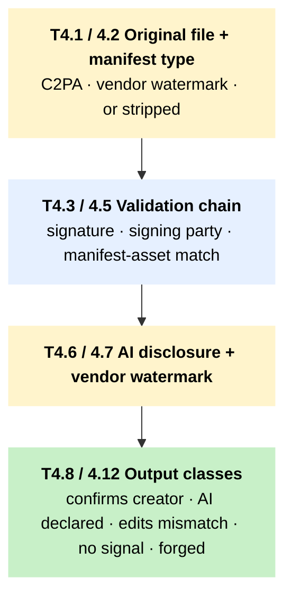

# T4 – Provenance triage when content carries C2PA, Content Credentials, or watermark signals

!!! abstract "TL;DR"
 Use this tree any time an image, video, or audio file you are working on carries C2PA / Content Credentials, a vendor-specific watermark such as [SynthID](../tool-cards/synthid-detector.md), or a creator-attestation manifest. The tree reads what the manifest claims, checks whether the chain is intact and whether the signing party is plausible, and returns a non-detector signal class that feeds back into [T1](t1-image-triage.md), [T2](t2-video-triage.md), or T3.

## When to use this tree

Provenance is the toolkit's most reliable signal class. It is the only one that travels with the file; everything else has to be inferred from the file. C2PA / Content Credentials adoption in the region is patchy, though, and T4 is useful only when the original file is in your hands. That excludes most of what reaches a newsroom – TikTok, WhatsApp, LINE, and Facebook reposts arrive with the manifest stripped by platform re-encoding. So the tree starts by resetting expectations: absence of credentials on a SEA-distributed file is normal, not suspicious. From there it reads what the credentials say when they do survive – creator, edit history, AI-use disclosure, timestamp, signing chain – and turns that reading into a verdict the toolkit can use without overstating.

Two cases use this tree most often in practice. A file arrives from a newsroom partner, a press agency, or an institutional source where Content Credentials have become standard. Or someone needs a quick vendor-watermark check on Imagen / Veo content through [SynthID Detector](../tool-cards/synthid-detector.md). The question in the second case is narrower – was this generated on Google's stack? – but the signal class returned is the same one.

## The tree

The diagram is a **macro view** of the provenance chain. Click any block to jump to its Node detail row.

Side exits, kept out of the diagram for clarity:

- **Vulnerable source** at [T4.1](#t4-1) → [T6 S1 source-protection](t6-source-protection.md); manifest itself may contain identifying fields.
- **Repost / screenshot** at [T4.1](#t4-1) → straight to [T4.11 no provenance signal](#t4-11), fall back to T1 / T2 / T3.
- **Forged manifest** at [T4.3](#t4-3) or [T4.4](#t4-4) → [T4.12 tampered](#t4-12), then directly to [T5.17 external expert escalation](t5-escalation.md).
- **No manifest** at [T4.2](#t4-2) → [T4.11](#t4-11), the default for SEA-distributed content; not evidence either way.

## How to read this tree

T4 is short on purpose. The five terminal nodes correspond to five distinct pieces of evidence the workflow can return to the calling tree. Each is one signal class under Architectural Anchor 2:

- **T4.8 confirms creator and origin.** A valid Content Credentials chain plus a plausible signer plus a manifest that matches the claim. This is a strong non-detector signal class. Pair it with one more class (T1.5 reverse search, T1.4 existing debunk, T2.11 event plausibility) to clear the two-non-detector-signals threshold.
- **T4.9 AI-generated declared.** Either C2PA explicitly states AI use or a vendor watermark fires positive. This is rare in viral SEA distribution because most stacks (Midjourney, Stability, OpenAI) do not embed in a way that survives platform re-encoding. SynthID covers Google's stack only.
- **T4.10 edits or chain mismatch.** Manifest exists but the edit history reveals a transformation that contradicts the claim, or signing chain has gaps. Treat as a flag, not as a verdict; route to T1.13 / T2.15 (false-context handling) or [T5](t5-escalation.md).6 / T5.7 (professional review).
- **T4.11 no provenance signal.** Default state for SEA-distributed content. Continue with T1.3 (visible anomalies), T1.4 (existing debunks), T1.5 (reverse search), and so on. Absence is not evidence.
- **T4.12 manifest tampered or forged.** Rare and high-impact. Route directly to T5.17 external expert escalation. A forged C2PA manifest is itself a finding that warrants institutional handling.

The architectural framing the tree enforces: provenance is a non-detector signal class. It satisfies one half of the Anchor 2 two-class requirement, not the whole requirement.

## Node detail

| Node | Question or action | Time | Tools |
|---|---|---|---|
| T4.1 | Confirm you have the original file. Reposts and screenshots strip manifests; do not invent provenance from a re-encoded copy. | 1 to 2 min | – |
| T4.2 | Identify manifest type: C2PA / Content Credentials, vendor watermark (SynthID for Google's stack), or absent. | 1 to 3 min | [Content Credentials Verify](../tool-cards/content-credentials-verify.md), [C2PA Conformance Explorer](../tool-cards/c2pa-conformance-explorer.md), [SynthID Detector](../tool-cards/synthid-detector.md) |
| T4.3 | Manifest chain intact? Read signature chain, edit history depth, and whether each step is signed. | 2 to 5 min | [C2PA Conformance Explorer](../tool-cards/c2pa-conformance-explorer.md) |
| T4.4 | Is the signing party plausible? Camera vendor, named creator, named editor, named AI vendor. Implausible signing party is a flag, not a verdict. | 2 to 5 min | – |
| T4.5 | Manifest claims match the asset's real claim? Compare the C2PA manifest's stated origin and edit history with the caption or claim attached at distribution. | 2 to 5 min | – |
| T4.6 | AI-use disclosure: does the manifest explicitly declare AI generation or AI editing? Silence is not denial. | 1 to 3 min | – |
| T4.7 | Vendor watermark check: does SynthID Detector return positive for Google-stack generation? Equivalent watermark systems remain closed-source for most other stacks. | 1 to 3 min | [SynthID Detector](../tool-cards/synthid-detector.md) |
| T4.8 | Output: provenance confirms creator and origin. One non-detector signal class. | 1 min | – |
| T4.9 | Output: provenance declares AI-generated. One non-detector signal class. | 1 min | – |
| T4.10 | Output: edits or chain mismatch. Flag, not verdict. | 1 min | – |
| T4.11 | Output: no provenance signal. Fallback to T1 / T2 / T3 modality flow. Absence is not evidence. | 1 min | – |
| T4.12 | Output: manifest tampered or forged. Route to T5.17. | 1 min | – |

## Regional and platform routing

C2PA penetration on SEA-popular handsets and platforms is low (Realme, Oppo, Vivo, Xiaomi, Transsion in the consumer tier; WhatsApp, LINE, TikTok, and Facebook all strip manifests on upload). Treat T4.11 (no provenance signal) as the default outcome for any forwarded content. Provenance is most operationally useful when the file enters via a press agency, an institutional partner, or a creator who has explicitly embedded credentials.

Platform notes:

- `-tiktok` / `-fb` / `-fbg`: re-encoding strips manifests. Run T4 only if the user-submitted file pre-dates upload.
- `-wa` / `-line`: voice notes and forwarded media are stripped. Tipline-submitted originals before forward may retain manifests.
- `-telegram`: original-file forwarding (not "send as photo") preserves manifests.
- `-youtube`: manifests survive on the original upload but are not exposed in the public stream; verification requires download of the original.

## Cross-references

T4 is called from T1.2, T2.6, and T3 when the calling tree's CONDITION reads provenance metadata. T4's outputs feed back into the calling tree as one non-detector signal class. T4.12 (forged manifest) routes to T5.17. Source-protection callouts:

- [T6 – source-protection](t6-source-protection.md) – S1 if the file's manifest contains creator name, location, or device IDs that identify a vulnerable source. Read the manifest before sharing the file with any third party, and redact identifying fields if the file must move.

Anchor tool cards: [Content Credentials Verify](../tool-cards/content-credentials-verify.md) is the fastest reader; [C2PA Conformance Explorer](../tool-cards/c2pa-conformance-explorer.md) is the institutional-tier validator; [SynthID Detector](../tool-cards/synthid-detector.md) covers Google-stack vendor watermarks.

## Sources

- Coalition for Content Provenance and Authenticity (C2PA). *C2PA Technical Specification 2.x.* [c2pa.org](https://c2pa.org/specifications/).
- Content Authenticity Initiative. *Content Credentials: How It Works.* Adobe / CAI, 2025. [contentauthenticity.org](https://contentauthenticity.org/how-it-works).
- Google DeepMind. *SynthID: Identifying AI-generated content.* Google, 2025. [deepmind.google/technologies/synthid](https://deepmind.google/technologies/synthid/).
- WITNESS Media Lab and Reuters Institute. *Thinking About Deepfakes: A Verification Framework for Journalists.* WITNESS, April 2024. [witness.org](https://lab.witness.org/backgrounder-deepfakes-in-2020/). (Provenance-first verification as a non-detector alternative.)
- [Architectural Anchors](../methodology/architectural-anchors.md) — Anchor 1 (provenance as one of four signal pillars) and Anchor 2 (two non-detector signals floor).
