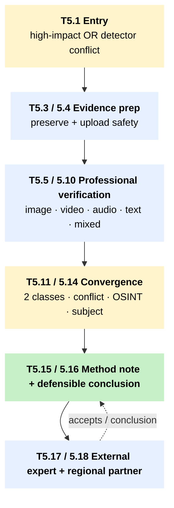
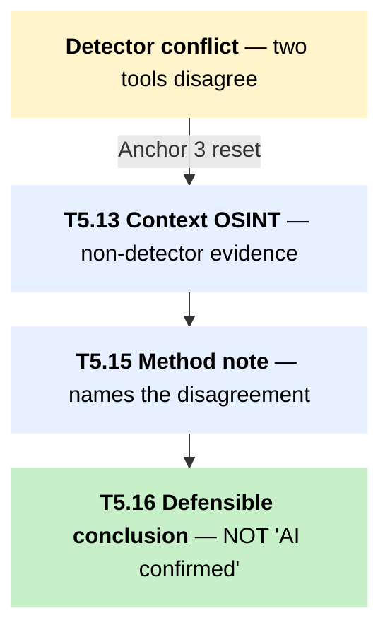

# T5 – Escalation when first-line triage is inconclusive or tools disagree

!!! abstract "TL;DR"
 Use this tree when [first-line triage](../pillar-1-detection/1a-first-line-triage.md) cannot reach a defensible result, when harm is high enough that the toolkit's two-non-detector-signals threshold has not yet been cleared, or when two detectors disagree. The workflow routes by content type into [professional verification](../pillar-1-detection/1b-professional-verification.md) and ends at one of six narrow conclusions, including the explicit option of "insufficient evidence" carried forward as a published method note.

## When to use this tree

Three triggers move a case out of the first-line trees and into T5. The first is impact: elections, violence, communal tension, public health, financial fraud, public officials, journalists or activists, minors, alleged crimes, or state-linked actors. The second is signal incompleteness – only one evidence class supports a synthetic label after [T1](t1-image-triage.md) to T4 are run.

The third is the one this toolkit treats as load-bearing under Foundational Decision 3: detector disagreement. When [Hive AI](../tool-cards/hive-ai.md), [Sensity](../tool-cards/sensity.md), [Reality Defender](../tool-cards/reality-defender.md), [Deepware](../tool-cards/deepware-scanner.md), or [TrueMedia / Georgetown](../tool-cards/truemedia-georgetown.md) return conflicting verdicts on the same artefact, the right response is not to average their scores or pick the loudest one. Step out of the detector layer entirely and reaffirm Architectural Anchor 2: at least two non-detector signal classes are required before any strong public claim. Sensity and Hive's multimodal stacks already count as one class under Anchor 3, not several. Adding a third detector to "break the tie" does not generate new evidence; it generates a louder version of the same evidence class.

## The tree

The diagram is a **macro view** of the main escalation chain. Click any block to jump to its row in the *Node detail* table below — that is the operational layer a fact-checker reads to find tools, time budgets, and exact wording for each step. A dedicated sub-diagram for the **Anchor-3 reset / detector conflict** path lives in the *Conflict resolution behaviour* section further down.

Side exits off the main chain — kept out of the diagram for clarity, documented here:

- **Low-impact case** at T5.1 → [T5.2 Low-harm monitor](#t5-2) (skip the chain; log and watch via tipline).
- **Safety risk** at T5.1 or T5.4 → [T6 source-protection](t6-source-protection.md) (apply S1 / S2 / S3 / S4 / S5 before any tool upload or third-party contact).
- **Coordination dominates** at T5.5 or T5.11 → coordinated-operation analysis (see the 1C Institutional Analysis section).
- **Unsafe upload** at T5.4 → [T5.17 External expert](#t5-17) directly, bypassing the in-house verification chain.
- **High harm at convergence** (T5.11 / T5.12) → [T5.17 External expert](#t5-17), then back to T5.15 method note before publication.
- **Public response** at T5.16 → [T7 tipline routing](t7-tipline-routing.md) for the per-country response surface.

## How to read this tree

T5 has two doors. Most cases enter through T5.1 from T1 to T4, after the first-line workflow could not close the case at the required confidence. A separate door – the "tools disagree, Anchor 3 reset" branch – exists for the specific failure mode where two detectors disagree on the same artefact and the operator is tempted to settle the disagreement with a third detector. That branch routes directly to T5.13 contextual OSINT and locks in a method-note requirement at T5.15. The published output names the disagreement, names that detector evidence on its own does not satisfy Anchor 2, and reasons forward only on non-detector classes – provenance, source-history, behaviour.

The six classes of professional conclusion, written narrowly:

- false context (authentic media, false caption);
- manipulated or synthetic likely (forensic-grade evidence, not a label);
- AI-generated confirmed by provenance, expert, or source admission;
- authentic media but misleading claim;
- claim false, media origin unresolved (the liar's-dividend safe option);
- insufficient evidence (a defensible result, not a failure).

A "confirmed AI" or "confirmed deepfake" label without provenance, expert, or source confirmation routes to T5.17 before publication. The toolkit's editorial position is that this constraint is not optional.

## Node detail

| Node | Question or action | Time | Tools |
|---|---|---|---|
| T5.1 | Escalation gate. Elections, violence, communal tension, public health, financial fraud, public officials, journalists, activists, minors, sexual content, alleged crimes, state-linked actors. | 1 to 3 min | – |
| T5.2 | Low-harm, low-spread, not legally sensitive: log, preserve minimal evidence, monitor through tipline / social listening. | 3 to 5 min | – |
| T5.3 | Build the evidence bundle: original file, URL, screenshots, timestamps, platform, uploader, captions, comments, tool outputs, hash, chain of custody. | 10 to 30 min | [Auto Archiver](../tool-cards/auto-archiver.md), [InVID-WeVerify](../tool-cards/invid-weverify.md) WACZ |
| T5.4 | Safe to upload to third-party tools? Source identification, child safety, whistleblower, location, legally sensitive actor. | 2 to 5 min | – |
| T5.5 | Classify content type (image / video / audio / text / mixed / coordination) and signal strength (weak / conflicting / two independent / strong contextual contradiction). | 2 to 4 min | – |
| T5.6 | Image professional: pixel forensics, provenance, metadata, ensemble detector, localisation heatmap. | 30 to 90 min | [InVID-WeVerify](../tool-cards/invid-weverify.md), [FotoForensics](../tool-cards/fotoforensics.md), [Sherloq](../tool-cards/sherloq.md), [TruFor](../tool-cards/trufor.md), [Sensity](../tool-cards/sensity.md), [Hive AI](../tool-cards/hive-ai.md) |
| T5.7 | Video professional: keyframes, reverse search, deepfake panel, physics and context checks. | 45 to 120 min | [InVID-WeVerify](../tool-cards/invid-weverify.md), [Deepware Scanner](../tool-cards/deepware-scanner.md), [Sensity](../tool-cards/sensity.md), [Reality Defender](../tool-cards/reality-defender.md), [TrueMedia / Georgetown](../tool-cards/truemedia-georgetown.md) |
| T5.8 | Audio professional: verified transcript, comparison with known recordings, audio detector with codec and language note. | 45 to 120 min | [OpenAI Whisper](../tool-cards/openai-whisper.md), [Hiya Loccus](../tool-cards/hiya-loccus.md), [Reality Defender](../tool-cards/reality-defender.md), [Hive AI](../tool-cards/hive-ai.md) |
| T5.9 | Text professional: claim extraction and matching, source tracing, behaviour analysis. AI-text detection only as a style flag. | 30 to 120 min | [Meedan Check](../tool-cards/meedan-check.md), [Meedan Alegre](../tool-cards/meedan-alegre.md), [ClaimBuster](../tool-cards/claimbuster.md), [Yudistira](../tool-cards/yudistira-mafindo.md), [X-CLAIM](../tool-cards/x-claim.md), [Google Pinpoint](../tool-cards/google-pinpoint.md) |
| T5.10 | Mixed-media: split case across modalities, return per-modality confidence note, recombine with caveats. | 60 to 180 min | per modality |
| T5.11 | Two independent evidence classes converging? Provenance, reverse / source trace, metadata, visual or audio anomaly, detector, contextual contradiction, subject confirmation, distribution pattern. Multi-detector counts as one class under Anchor 3. | 5 to 10 min | – |
| T5.12 | Conflict resolution. Re-test on original and compressed versions; compare tool explanations; check whether file quality, compression, language, or cropping explains the conflict. Reframe from "AI verdict" to "what can be verified?" | 20 to 60 min | – |
| T5.13 | Contextual OSINT: geolocation, weather, shadows, architectural cross-reference, official schedules, archival footage, local witness or source check. | 30 to 180 min | [GeoSpy](../tool-cards/geospy.md) for leads, [Google Pinpoint](../tool-cards/google-pinpoint.md) for documents, [InVID-WeVerify](../tool-cards/invid-weverify.md) |
| T5.14 | Subject, uploader, venue, or authority contact through verified channels. Narrow questions; preserve replies. | 30 min to 24 h | – |
| T5.15 | Method note: tool name, date, file version, compression, language and accent, upload safety, output, why the tool was or was not used in the conclusion. | 5 to 10 min | – |
| T5.16 | Choose the narrowest supported finding from the six-class list above. | 10 to 20 min | – |
| T5.17 | External forensic or expert escalation: WITNESS Deepfakes Rapid Response Force, Bellingcat, [vera.ai](../tool-cards/invid-weverify.md) network, institutional labs. Send minimised evidence bundle. | intake 20 to 60 min; response per partner | [WITNESS DRRF](../tool-cards/dw-innovation-audit.md) is the framework reference |
| T5.18 | Regional partner routing: Indonesia (Mafindo / CekFakta / Tempo), Philippines (Rappler / VERA / #FactsFirstPH), Thailand ([Cofact](../tool-cards/cofact-thailand.md)), Malaysia ([Sebenarnya AIFA](../tool-cards/sebenarnya-aifa.md) plus independent verification), Sri Lanka (Fact Crescendo / AFP Sinhala-Tamil / Hashtag Generation), Laos (regional or diaspora partner). | 5 to 30 min | per country |

## Conflict resolution behaviour – Anchor 3 reset

When two or more detectors disagree on the same artefact:

1. Stop. Do not run a third detector to break the tie. Multi-detector consensus is one signal class under Architectural Anchor 3.
2. Move the case into T5.13 (contextual OSINT) and T5.14 (subject contact) before any further detector work.
3. Apply Architectural Anchor 2: at least two non-detector signal classes (provenance, source-history, behaviour, contextual OSINT, subject confirmation) before any strong public claim.
4. Record the disagreement in the T5.15 method note. The published output names the conflict, names that detector evidence on its own is insufficient, and reasons forward only on non-detector classes.

This is the toolkit's standing answer to detector-stack-as-truth-machine, and it is the explicit output of Foundational Decision 3.

## Cross-references

- [T1 / T2 / T3 / T4](index.md) – feed cases into T5 when first-line triage is inconclusive.
- [T6 – source-protection](t6-source-protection.md) – S1, S2, S3, S4, S5 as gates at T5.1, T5.4, T5.14; S9 cross-border vendor retention before any T5.6 to T5.9 detector run.
- [T7 – tipline routing](t7-tipline-routing.md) – when the T5.16 conclusion routes to a public response or a tipline answer.

Anchor tool cards: [Sensity](../tool-cards/sensity.md), [Reality Defender](../tool-cards/reality-defender.md), [Hive AI](../tool-cards/hive-ai.md) for the multimodal detector layer; [TRIED Benchmark](../tool-cards/tried-benchmark.md) as the institutional reference framework for evaluating any detector before adoption; [InVID-WeVerify](../tool-cards/invid-weverify.md) for the cross-modality professional bundle.

## Sources

- WITNESS Media Lab and Reuters Institute. *Thinking About Deepfakes: A Verification Framework for Journalists.* WITNESS, April 2024. [witness.org](https://lab.witness.org/backgrounder-deepfakes-in-2020/). (Escalation criteria and inter-tool conflict resolution methodology.)
- Lyu, S. et al. *Deepfake-Eval-2024: A Real-World Benchmark for Deepfake Detection.* 2025. (Multi-detector category ceilings: best commercial video detector 0.78 accuracy / 0.79 AUC; basis for the Anchor 3 single-signal-class treatment when multiple commercial detectors are deployed.)
- Ha, B. et al. *Organic or Diffused: Can We Distinguish Human Art from AI-generated Images?* ACM CCS 2024. (Image detector robustness under adversarial edits and newer generators — basis for escalation gates at T5.3–T5.4.)
- WITNESS. *TRIED Benchmark: Synthetic Media Detection Benchmarking.* WITNESS, 2025. [witness.org/tried](https://lab.witness.org/projects/synthetic-media-and-deep-fakes/). (Institutional-tier evaluation framework invoked at T5.15–T5.18.)
- [Architectural Anchors](../methodology/architectural-anchors.md) — Anchors 1, 2, and 3; inter-tool conflict resolution operationalised at Anchor 3.
