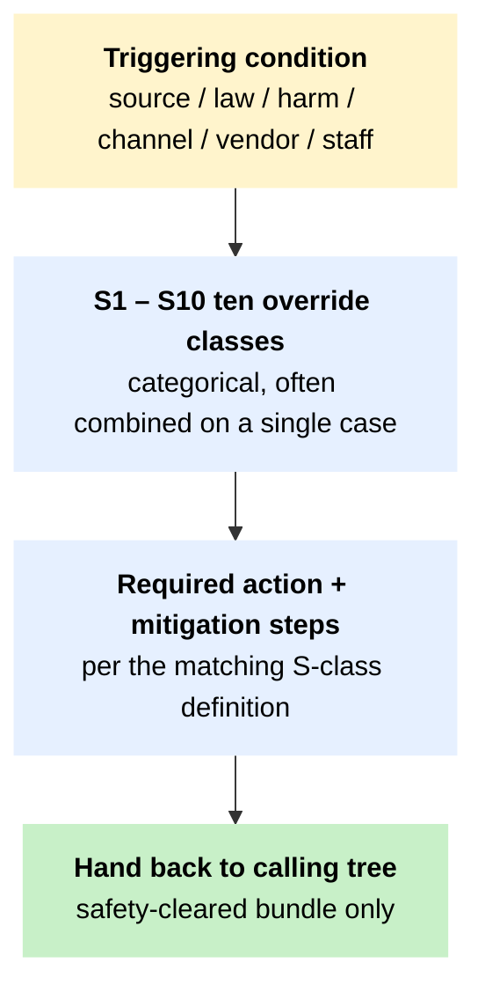

# T6 – Source-protection routing across the S1 to S10 safety overrides

!!! abstract "TL;DR"
 Use this tree as the canonical reference for the ten safety-override classes that the toolkit's other six trees and its tool cards reference by number. Each S-number is a triggering condition plus a required action; collected here, they form the source-protection layer of the workflow. Read T6 alongside the calling tree, not after.

## When to use this tree

Source-protection sits orthogonal to the modality trees. The other six trees ask what the content is and whether the claim attached to it is true. T6 asks a different question – who gets exposed if the workflow runs as written. Both questions are answered in parallel, on every case. Every callout from [T1](t1-image-triage.md), [T2](t2-video-triage.md), [T3](t3-audio-triage.md), [T4](t4-provenance-triage.md), [T5](t5-escalation.md), or [T7](t7-tipline-routing.md) to an S-number routes through here. The structure follows the ten safety-override classes documented in the [source-protection aggregation page](../digital-safety/source-protection-aggregation.md); they are intended to render as `!!! danger` admonitions on individual tool cards wherever a default workflow step would expose a source.

Coverage at a glance. Thirteen cards carry the S1 admonition: [InVID-WeVerify](../tool-cards/invid-weverify.md), [Hiya / Loccus](../tool-cards/hiya-loccus.md), [Reality Defender](../tool-cards/reality-defender.md), [FotoForensics](../tool-cards/fotoforensics.md), [Sensity](../tool-cards/sensity.md), [Hive AI](../tool-cards/hive-ai.md), [Deepware Scanner](../tool-cards/deepware-scanner.md), [TrueMedia / Georgetown](../tool-cards/truemedia-georgetown.md), [TruFor](../tool-cards/trufor.md), [GeoSpy](../tool-cards/geospy.md), [OpenAI Whisper](../tool-cards/openai-whisper.md) (hosted mode), [Google Cloud Translation](../tool-cards/google-cloud-translation.md), and [Google Pinpoint](../tool-cards/google-pinpoint.md). S2, S3, S4, S5, and S9 render on the smaller cohorts where each override actually binds and is not incidental. The remaining four classes sit elsewhere by design. S6 and S8 stay in T6 itself because they bind every detector card identically; rendering them sixty-five times would dilute the gate. S7 fires at the T7 platform-escalation step. S10 belongs in the Digital Safety section as a workflow-level rule, not a tool-level one. T6 is the source of truth for all ten.

## The tree

T6 is a **routing layer**, not a sequence. The diagram shows the macro structure — the ten S-classes live as detailed sub-sections below. More than one S-number often fires on the same case; the case has to clear all that apply before any tool upload or third-party contact.

Jump to a specific S-class: [S1](#s1-source-identifying-upload-risk) · [S2](#s2-state-linked-or-legally-sensitive-investigation) · [S3](#s3-graphic-sexual-child-safety-or-abuse-material) · [S4](#s4-doxxing-harassment-or-vulnerable-community-targeting) · [S5](#s5-private-or-encrypted-group-collection) · [S6](#s6-detector-only-accusation) · [S7](#s7-malware-apk-phishing-payment-or-id-harvesting-risk) · [S8](#s8-liars-dividend-risk) · [S9](#s9-cross-border-data-transfer-or-vendor-retention-risk) · [S10](#s10-staff-safety-and-trauma-risk).

## How to read this tree

T6 is a routing layer, not a sequence. Read the trigger row, find the S-number that matches the case, apply the required action, and return to the calling tree only after mitigation. More than one S-number often fires on the same case. S1 plus S2 plus S5 is a normal combination for a politically sensitive WhatsApp source in Laos, Sri Lanka, Thailand, or the Philippines; the case has to clear all three before any tool upload or third-party contact. The ten classes are not ranked. They are categorical.

The toolkit treats source-protection as editorial policy, not advice. A workflow that produces a verification at the cost of exposing a source is not a verification; it is a security incident with verification as a side effect. The S-overrides are the named gates that prevent this collapse.

## The ten overrides

### S1 – Source-identifying upload risk

**Trigger.** Content contains faces, voices, GPS, metadata, private handles, phone numbers, whistleblower material, victim identity, private group names, or original files from a vulnerable source.

**Required action.** Stop tool upload. Preserve original securely. Use local or on-device tools, or expert escalation with minimisation and consent.

**Mitigation steps.**

1. Classify the file as public, sensitive, or source-identifying before any upload.
2. For source-identifying material, do not use detector tools that route the file to a third-party server. Use reverse-image, EXIF, OCR, and archiving modules instead – these do not upload the source file to vendor-controlled servers.
3. If a detector verdict is operationally necessary, strip identifying context (crop, blur background, redact audio) on the local machine before uploading the redacted version.
4. If you uploaded by mistake, request vendor deletion via the documented support channel and disclose the upload to the source.

**Currently rendered as `!!! danger` on:** [InVID-WeVerify](../tool-cards/invid-weverify.md), [Hiya Loccus](../tool-cards/hiya-loccus.md), [Reality Defender](../tool-cards/reality-defender.md), [FotoForensics](../tool-cards/fotoforensics.md), [Sensity](../tool-cards/sensity.md), [Hive AI](../tool-cards/hive-ai.md), [Deepware Scanner](../tool-cards/deepware-scanner.md), [TrueMedia / Georgetown](../tool-cards/truemedia-georgetown.md), [TruFor](../tool-cards/trufor.md), [GeoSpy](../tool-cards/geospy.md), [OpenAI Whisper](../tool-cards/openai-whisper.md) (hosted mode), [Google Cloud Translation](../tool-cards/google-cloud-translation.md) (sensitive content), [Google Pinpoint](../tool-cards/google-pinpoint.md) (sensitive documents).

### S2 – State-linked or legally sensitive investigation

**Trigger.** Content concerns police, military, monarchy, ruling party, cybercrime / fake-news laws, protest movements, red-tagging, national security, or authoritarian contexts.

**Required action.** Consult Digital Safety / legal / editor before outreach, publication, platform reporting, or contact with state-linked actors.

**Country-specific legal anchors.** Thailand Article 112 lèse-majesté; Sri Lanka Online Safety Act; Indonesia EIT Law (UU ITE); Malaysia CMA Section 233; Laos Decree 327. The country pages will carry per-jurisdiction operational guidance; for [First-Line Triage](../pillar-1-detection/1a-first-line-triage.md), S2 is binary – it fires or it does not, and when it fires the editor approval gate is mandatory.

**Currently rendered as `!!! danger` on:** [Sebenarnya AIFA](../tool-cards/sebenarnya-aifa.md), [Cofact Thailand](../tool-cards/cofact-thailand.md), [Information Tracer](../tool-cards/information-tracer.md), [Maltego](../tool-cards/maltego.md), [Media Cloud](../tool-cards/media-cloud.md). Additional cards reference S2 in prose where the regional case work touches state-linked actors.

### S3 – Graphic, sexual, child-safety, or abuse material

**Trigger.** Content includes sexual imagery, minors, abuse, corpses, graphic violence, torture, or non-consensual intimate imagery.

**Required action.** Do not upload to general tools. Follow newsroom / legal / platform protocols; minimise viewing; protect staff well-being; preserve only what policy allows.

**Currently rendered as `!!! danger` on:** [Auto Archiver](../tool-cards/auto-archiver.md). Additional cards (the 1B / 1C image-and-video detector cards used in conflict and violence verification) reference S3 in prose; the Digital Safety section will codify newsroom-level S3 protocol when that batch lands.

### S4 – Doxxing, harassment, or vulnerable-community targeting

**Trigger.** Content identifies activists, journalists, ethnic / religious minorities, LGBTQ+ people, migrants, witnesses, alleged criminals, or private citizens.

**Required action.** Redact identifiers, avoid repeating slurs / addresses, assess retaliation risk, and consider a quiet response or tipline-only response in place of a public debunk.

**Currently rendered as `!!! danger` on:** [Information Tracer](../tool-cards/information-tracer.md), [Maltego](../tool-cards/maltego.md), [Sinar Project iMAP](../tool-cards/sinar-project-imap.md), [CIB Mango Tree](../tool-cards/cib-mango-tree.md). Other coordinated-operation tools reference S4 in prose where attribution risk is non-trivial.

### S5 – Private or encrypted group collection

**Trigger.** Evidence comes from WhatsApp, LINE, private Telegram, closed Facebook Groups, or private Messenger / Viber chats.

**Required action.** Use consented submissions and tiplines only. Do not scrape, infiltrate, or expose group members without an explicit organisational protocol.

**Currently rendered as `!!! danger` on:** [Meedan Check](../tool-cards/meedan-check.md), [Cofact Thailand](../tool-cards/cofact-thailand.md), [MAFINDO Kalimasada](../tool-cards/mafindo-kalimasada.md), [Sebenarnya AIFA](../tool-cards/sebenarnya-aifa.md). The tipline cards already carry this discipline in their workflow text; the standalone admonition reinforces it.

### S6 – Detector-only accusation

**Trigger.** The only evidence for "AI-generated," "deepfake," "voice clone," "bot," or "coordinated inauthentic behaviour" is one or more automated tool scores.

**Required action.** Stop. Reframe as "tool flagged for review." Seek independent evidence, or escalate to T5 / coordinated analysis.

**This override is the operational expression of Architectural Anchor 2** (two non-detector signals required) and Anchor 3 (multi-detector counts as one signal class). It applies to every detector card in the toolkit. Rather than render on each detector individually, S6 is documented here as a global gate that the [T5 escalation](t5-escalation.md) tree's Anchor-3-reset branch enforces.

### S7 – Malware, APK, phishing, payment, or ID-harvesting risk

**Trigger.** Content directs users to APKs, payment, "registration," WhatsApp / Telegram forms, aid claims, investment platforms, or credential collection.

**Required action.** Do not click or install on work or personal device. Preserve link safely. Escalate as scam / impersonation through [T7 response](t7-tipline-routing.md) and through technical / security support.

**Region context.** Indonesia and Malaysia deepfake-aid scams routed to WhatsApp; voice-scams in Thailand; impersonation funnels in the Philippines. The country pages will carry the documented patterns; on T7 the routing into platform escalation is direct.

### S8 – Liar's-dividend risk

**Trigger.** A powerful actor claims real evidence is AI-generated, or the newsroom is tempted to label something fake without independent proof.

**Required action.** Verify source, context, and provenance. Say "we cannot verify AI manipulation" when evidence is insufficient; do not say "fake."

**This override is the editorial twin of S6** – S6 prevents over-claiming AI from a detector signal; S8 prevents the political abuse of "could be AI" as a way to dismiss real abuse, corruption, violence, or testimony. Both apply to every fact-check format the toolkit produces.

### S9 – Cross-border data transfer or vendor retention risk

**Trigger.** Hosted tools require upload of sensitive content to proprietary APIs or foreign servers.

**Required action.** Check organisational data policy, vendor retention terms, and source consent. Prefer local or on-device tools or trusted expert channels.

**Vendor jurisdiction map.** US: Hive, Reality Defender, [Hiya / Loccus](../tool-cards/hiya-loccus.md), TrueMedia, Resemble, Pindrop, Winston, Copyleaks, Logically, Full Fact AI. EU: CERTH (under InVID-WeVerify deepfake tab), vera.ai consortium. The 30-day retention window on InVID's deepfake tab is the most explicitly documented vendor-retention policy; treat it as the reference case.

**Currently rendered as `!!! danger` on:** [InVID-WeVerify](../tool-cards/invid-weverify.md) (the 30-day CERTH window reference case), [Hive AI](../tool-cards/hive-ai.md), [Reality Defender](../tool-cards/reality-defender.md), [Hiya Loccus](../tool-cards/hiya-loccus.md), [TrueMedia / Georgetown](../tool-cards/truemedia-georgetown.md), [Sensity](../tool-cards/sensity.md), [Deepware Scanner](../tool-cards/deepware-scanner.md).

### S10 – Staff safety and trauma risk

**Trigger.** Repeated viewing or listening, harassment backlash, threats, graphic content, or coordinated abuse after publication.

**Required action.** Limit exposure, rotate reviewers, document threats, secure accounts and devices, and activate the newsroom safety protocol.

**Currently referenced on:** individual tool cards where 1C and 2C workflows require repeated viewing of harmful content. S10 is a workflow-level override; it lives in the Digital Safety section rather than on individual tool cards.

## Cross-references

Calling trees:

- [T1 image](t1-image-triage.md), [T2 video](t2-video-triage.md), [T3 audio](t3-audio-triage.md): S1, S2, S5, S9 fire most often at the upload nodes.
- [T4 provenance](t4-provenance-triage.md): S1 fires when the manifest itself contains source-identifying fields.
- [T5 escalation](t5-escalation.md): S1, S2, S3, S4, S5 fire at T5.4 (upload safety), T5.14 (subject contact); S6 is the explicit gate at the Anchor-3 reset branch.
- [T7 tipline routing](t7-tipline-routing.md): S2, S4, S5, S7 fire at the response gate.

T6 is the source of truth for the ten safety-override classes. Where a tool card renders an S-admonition, the wording and operational steps trace back to this page; if T6 is revised, the cards inherit the revision.

## Sources

- Electronic Frontier Foundation. *Surveillance Self-Defense.* EFF, 2025. [ssd.eff.org](https://ssd.eff.org/). (S1, S4, S5, S9 class risk framing; operational device and communications security guidance.)
- Committee to Protect Journalists. *Digital Safety.* CPJ, 2025. [cpj.org/digital-safety](https://cpj.org/digital-safety/). ([Source-protection threat models](../digital-safety/threat-models.md) for journalists in high-risk environments; S2 and S4 class framing.)
- Access Now. *Digital Security Helpline.* Access Now, 2025. [accessnow.org/help](https://www.accessnow.org/help/). (Secure device and communications guidance for civil society in SEA restrictive environments.)
- WITNESS Media Lab and Reuters Institute. *Thinking About Deepfakes: A Verification Framework for Journalists.* WITNESS, April 2024. [witness.org](https://lab.witness.org/backgrounder-deepfakes-in-2020/). (S6 detector-only-accusation caution; S8 liar's-dividend risk framework.)
- Tool cards rendering S1 through S9 admonitions — per-class listings above.
- [Architectural Anchors](../methodology/architectural-anchors.md) — Anchors 2 and 3 as the basis for S6 and S8 binding gates.
