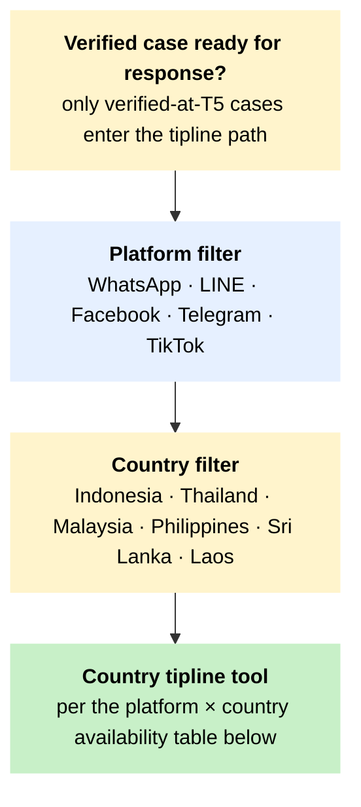

# T7 – Tipline routing across platforms and countries

!!! abstract "TL;DR"
 Use this tree when a verified case is ready to leave the verification workflow and reach the user who originally submitted it, or to enter a country tipline as a canonical claim for future reuse. The routing is platform-by-country: where the user is and which platform they used decides which tipline tool the response goes through. The tree names the country–platform combinations where no tipline exists.

## When to use this tree

Tiplines are the toolkit's most regionally-anchored response surface. A debunk on a website reaches a public audience; a tipline reaches the one user who asked. The constraint that follows from this is geographic and platform-bound. [MAFINDO Kalimasada](../tool-cards/mafindo-kalimasada.md) covers Bahasa-Indonesian on WhatsApp. [Cofact Thailand](../tool-cards/cofact-thailand.md) covers Thai on LINE. [Sebenarnya AIFA](../tool-cards/sebenarnya-aifa.md) covers Malaysia, with the operator caveat the toolkit treats as load-bearing. [Meedan Check](../tool-cards/meedan-check.md) sits underneath several of these as a cross-country backbone, but the user never interacts with Check directly – what they see is always the local product. Where no country–platform combination has a tool at all, the tree names the absence and routes the case into broader Pillar 2 channels: coalition coordination, public debunk, partner alert.

## The tree

The diagram is a **macro view** of the platform → country filter. The detailed country × platform availability — including the documented Laos gap — lives in the table below.

Side exits, kept out of the diagram for clarity:

- **Inconclusive but high-harm** → public debunk + coalition route, not a tipline answer.
- **Public-figure synthetic-media accusation** → editor and legal review (S2) before any answer.
- **Source-protection in play (S1 / S4)** → redacted tipline answer and redacted canonical claim.
- **Laos** → no documented independent tipline; route through trusted regional or diaspora partner.

## How to read this tree

The two filter questions are platform and country – in that order. The tipline a response goes through is determined by the country the user is in, not the language of the content. A Bahasa-Indonesian video circulating in Malaysia routes through Sebenarnya AIFA, not Kalimasada, because the user is reachable via the Malaysian system. Cross-border content (a Thai-language video circulating in the Philippines, for example) routes through the destination country's tipline. Where both ends of the spread are inside the focus six, the canonical claim should be added to both tiplines to support future automated matching at [Meedan Alegre](../tool-cards/meedan-alegre.md).

The four routing classes:

- a verified case with a country tipline available → tipline response, claim added to canonical database, future submissions auto-matched;
- a verified case with no country tipline (Laos) → trusted regional or diaspora partner via [T5.18 regional partner routing](t5-escalation.md), or quiet response via partner;
- an inconclusive but high-harm case → public debunk plus coalition coordination, not a tipline answer (a tipline answer to "we don't know" is rarely useful);
- a low-harm low-spread case → quiet monitor, no tipline response yet (the canonical claim still enters the database for future matching).

## Country and platform availability

The table below names what currently exists. The Lao line is the structural gap-close required by Foundational Decision 7 – the toolkit names the absence on the page; it does not paper over it.

| Country | WhatsApp | LINE | Facebook | Telegram | TikTok | Tipline tool of record |
|---|---|---|---|---|---|---|
| Indonesia (`-id`) | yes | – | partial | partial | – | [MAFINDO Kalimasada](../tool-cards/mafindo-kalimasada.md), Tempo Cek Fakta, [Yudistira](../tool-cards/yudistira-mafindo.md) for claim matching |
| Thailand (`-thai`) | – | yes | – | – | – | [Cofact Thailand](../tool-cards/cofact-thailand.md) |
| Malaysia (`-ms`) | partial | – | partial | partial | – | [Sebenarnya AIFA](../tool-cards/sebenarnya-aifa.md) – government-operator caveat applies; pair with an independent newsroom check |
| Philippines (`-ph`) | partial | – | yes | – | – | [VERA Files](../tool-cards/x-claim.md) (X-CLAIM coalition), Rappler / #FactsFirstPH, [AI Fact Checker App](../tool-cards/ai-fact-checker-app.md) |
| Sri Lanka (`-si-ta`) | – | – | yes | – | – | Fact Crescendo, AFP Sinhala / Tamil, Hashtag Generation; [Watchdog Dissect](../tool-cards/dissect-watchdog-lirneasia.md) for stylometric work feeding the editorial workflow |
| Laos (`-lao`) | – | – | – | – | – | **No documented independent tipline.** Route through trusted regional or diaspora partner; see the Laos country page when published. |

[Meedan Check](../tool-cards/meedan-check.md) is the cross-country backbone that several of these tools build on (Kalimasada, Cofact, Sebenarnya AIFA components). The user never interacts with Check directly; the tipline is always the local-language product.

## Response format by tipline

A tipline answer is shorter than a public debunk. The format is verdict, evidence in two or three lines, and a shareable correction the user can forward back into the original group. Reuse the canonical claim and verdict from [Meedan Alegre](../tool-cards/meedan-alegre.md) where the tipline already has it. Where the case is the first of its kind, draft the canonical claim in the originating language plus English; the English version supports cross-tipline matching at the regional level.

For scam funnels (S7) the response includes the platform escalation packet alongside the tipline answer – payment URLs, account IDs, archived copies, screenshots, harm category. Send the packet through the platform's reporting channel (Meta, TikTok, LINE, Telegram, WhatsApp) before posting the tipline answer if the funnel is still live; preservation comes before takedown.

## When the response should not go through a tipline

Three cases where a tipline answer is the wrong format:

1. **Inconclusive verification, high harm.** The user wants a verdict; the tipline cannot give one. Route to public debunk plus coalition coordination, with a method note that names the uncertainty.
2. **Public-figure synthetic-media accusation.** The case warrants editor and legal review before any answer (S2). A tipline-only answer that names a public figure as a deepfake target is exposed to defamation risk.
3. **Source-protection in play.** If the original submission identifies the source (S1, S4), the tipline answer goes back redacted, and the canonical claim entering the database is similarly redacted. Better to under-share than to expose.

## Cross-references

- [T1](t1-image-triage.md), [T2](t2-video-triage.md), [T3](t3-audio-triage.md) – T7 receives verified-case hand-offs from any of these.
- [T4 provenance](t4-provenance-triage.md) – when a tipline answer has to explain a Content Credentials reading to a non-specialist user; keep it short.
- [T5 escalation](t5-escalation.md) – T7 only receives cases that exited T5 with a defensible conclusion; an inconclusive T5 conclusion routes to public debunk plus coalition, not to a tipline.
- [T6 source-protection](t6-source-protection.md) – S2, S4, S5, S7 fire at the response gate. Apply before sending the tipline answer.

Anchor tool cards: [MAFINDO Kalimasada](../tool-cards/mafindo-kalimasada.md), [Cofact Thailand](../tool-cards/cofact-thailand.md), [Sebenarnya AIFA](../tool-cards/sebenarnya-aifa.md), [Meedan Check](../tool-cards/meedan-check.md), [Meedan Alegre](../tool-cards/meedan-alegre.md), [X-CLAIM](../tool-cards/x-claim.md), [AI Fact Checker App](../tool-cards/ai-fact-checker-app.md).

## Sources

- Country pages: [Indonesia](../countries/indonesia.md), [Malaysia](../countries/malaysia.md), [Philippines](../countries/philippines.md), [Thailand](../countries/thailand.md), [Sri Lanka](../countries/sri-lanka.md), [Laos](../countries/laos.md) — per-country tipline notes and routing detail (including Lao honest-gap framing).
- [Architectural Anchors](../methodology/architectural-anchors.md) — regional suffix scheme and honest-gap policy operationalised here.
